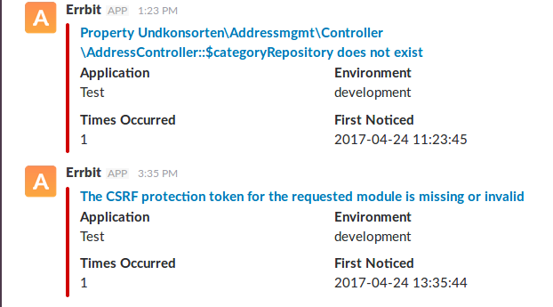

# errbit
Automated error tracking for your Typo3 projects.

## What does it do?
(Exception on client Website) -> (Errbit) -> (Notification(Slack|Ticket|Mail...))

The Extension catches all occurring exception and communcaties them to an errbit/airbrake server.
The errbit server can be configured to notify users (developers) via mail,slack, create a ticket and so on.

See here 
- https://github.com/errbit/errbit
- https://airbrake.io/



## Installation
-  Install the extension
-  Change the default exception handler (install tool or LocalConfiguration.php)
```
'debugExceptionHandler' => 'Eike\\Errbit\\DebugExceptionHandler',
'productionExceptionHandler' => 'Eike\\Errbit\\ProductionExceptionHandler',
'ErrorHandler' => 'Eike\\Errbit\\ErrorHandler',
```
Of course you can also just activate one or two of the handler.

E.g if you just want exceptions to be tracked in production mode you just register productionExceptionHandler.

## Configuration

Via the extension manager you can configure the extension.

- apiKey: Your app api key in your errbit/airbrake installation
- host: URL to your errbit server (e.g. domain.com)
- port: The port errbit/airbrake listens on (https is 443)

